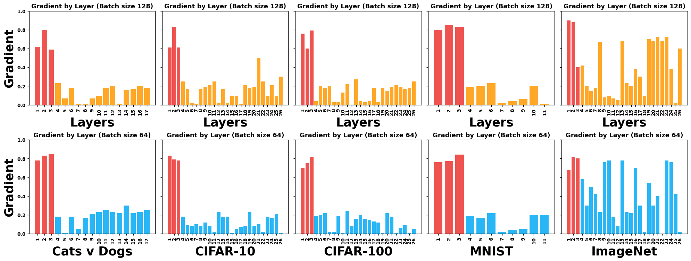
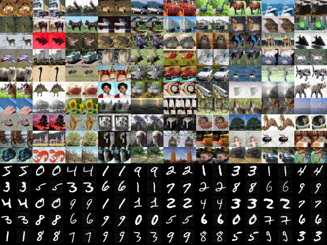
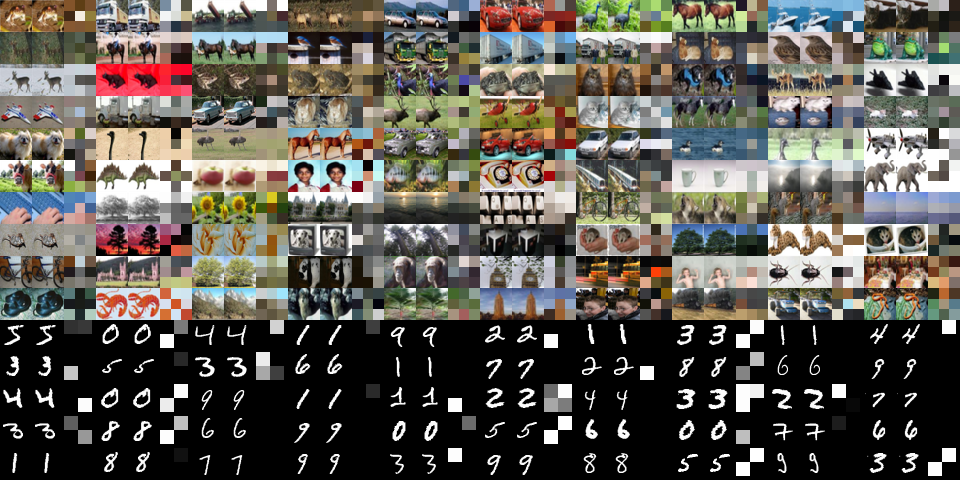

# DRArmor - Nosy Layers, Noisy Fixes: Tackling DRAs in Federated Learning Systems using Explainable AI

This repository contains the official implementation of **DRArmor** – a framework for detecting and mitigating data reconstruction attacks (DRAs) in Federated Learning (FL).

---

## 📄 Reference

> **"Nosy Layers, Noisy Fixes: Tackling DRAs in Federated Learning Systems using Explainable AI"**  
> *Meghali Nandi, Arash Shaghaghi, Nazatul Haque Sultan, Gustavo Batista, Raymond Zhao, Sanjay Jha*  
> Published at **ACM AsiaCCS 2025** (CORE A, acceptance rate: 19.7%)  
> 📚 [Read it on ACM DL](#) | 📄 [Read it on ArXiv](https://arxiv.org/abs/2505.10942)


---

## 📌 Overview
DRArmor is a modular framework for detecting and mitigating data reconstruction attacks (DRAs) in federated learning (FL). Building on the LOKI attack, DRArmor integrates explainable-AI (XAI) techniques—Layer-wise Relevance Propagation (LRP) and Deep Taylor Decomposition (DTD)—along with a Wasserstein-distance check to identify malicious layers. Once detected, clients can either prune those layers or apply Differential-Privacy (DP) Gaussian noise to their gradients before uploading to the server. DRArmor supports both FedAvg and FedSGD aggregation, and can run under a native Python loop or the Flower FL framework.

---

## 🚀 Key Features

- **Attack Integration**  
  - Wraps the adversarial reconstruction attack from [LOKI](https://github.com/Manishpandey-0/Adversarial-reconstruction-attack-on-FL-using-LOKI)  
- **Explainable-AI Defenses**  
  - **LRP**: recursive relevance propagation  
  - **DTD**: gradient-based Taylor decomposition  
  - **Wasserstein distance**: statistical check on layer-wise relevance  
- **Defense Actions**  
  - **Pruning**: remove malicious layers  
  - **DP-Gaussian**: clip and add Gaussian noise to gradients  
- **Aggregation Modes**  
  - **FedAvg** (weight averaging)  
  - **FedSGD** (gradient averaging via DP-Keras-SGD)  
- **Framework Support**  
  - Native Python FL loop  
  - Flower integration (`FlowerClient`, standard strategies)  
- **Configurable** via `config.yaml`: datasets, nodes, aggregation, defense, models, logging  
- **Model Zoo**  
  - MNIST CNN, CIFAR-10/100 ResNets, ImageNet ResNet, Cats v Dogs ResNet-18  
- **Dataset Sharding**: split any dataset across _n_ clients  

---

## 📦 Repository Structure

```text
DRArmor/
├── clients/                 
│   ├── client.py            
│   └── flower_client.py     
├── drarmor/                 
│   ├── engine.py            
│   ├── lrp_attributor.py    
│   ├── dtd_attributor.py    
│   └── defense.py           
├── loki_attack/             
│   └── loki.py              
├── models/                  
│   ├── mnist_model.py  
│   ├── cifar10_model.py  
│   ├── cifar100_model.py  
│   ├── imagenet_model.py  
│   └── resnet18.py  
├── utils/                   
│   └── dataset_loader.py    
├── requirements.txt         
├── config.yaml              
├── main.py                  
├── flower_main.py           
└── README.md   
```
---

## 🔧 Installation


1. **Clone the repository**  
   ```bash
   git clone https://github.com/yourusername/DRArmor.git
   cd DRArmor
   ```
2. **Create and activate a virtual environment (recommended)**  
   ```bash
   python3 -m venv venv
   source venv/bin/activate
    ```
3. **Install dependencies**
    ```bash
        pip install -r requirements.txt

    ```
4. **Prepare datasets**
    
    Download the datasets and keep inside the `data` directory
    

---

## 🎯 Usage

### 1. **Native Python FL Loop**

1. Edit `config.yaml` to the desired settings.

2. Run 
```bash
    python main.py
```
3. Outputs (models, logs) will appear in `logging.output_dir`.

### 2. **Flower Framework**

1. Start the Flower Server
```bash
    python flower_main.py
```

2. Launch Flower Clients

In separate terminals (one per client), run
```bash
    export FLWR_CLIENT_ID=0
    python clients/flower_client_run.py
```
## 📝 File Descriptions

- `clients/client.py`: Implements `FLClient` with DRArmor integration.
- `clients/flower_client.py`, `clients/flower_client_run.py`: Wrap and launch Flower clients.
- `drarmor/engine.py`: Coordinates detection (LRP/DTD) and defense (prune/DP).
- `drarmor/lrp_attributor.py`, `drarmor/dtd_attributor.py`: Compute layer-wise relevance scores.
- `drarmor/defense.py`: Prune or add DP-Gaussian noise to gradients.
- `loki_attack/loki.py`: Imports and wraps the LOKI attack.
- `models/*.py`: Keras model definitions for each dataset.
- `utils/dataset_loader.py`: Load, normalize, and shard datasets.
- `main.py`: Native Python FL entrypoint using `FederatedServer`.
- `flower_main.py`: Flower server entrypoint for federated training.

---

## ⚙️ Customization

- **Datasets**: Add loader in `utils/dataset_loader.py` and reference it in `config.yaml`.
- **Models**: Add a new model in `models/` and map it in `config.yaml`.
- **XAI Methods**: Implement new attribution methods in `drarmor/`.
- **Aggregation**: Switch between `fedavg` and `fedsgd` in `config.yaml`.
- **Defense Actions**: Choose between `prune`, `dp`, or `both` for gradient defense.

---

## 🎯 Results

### 🔍 Identifying Malicious Layers  
  
*Gradient analysis across datasets, identifying malicious layers at the start of the model with a threshold value of 0.5.*

---

### 🛡️ Post-Mitigation with Differential Privacy  
  
*Data reconstructed at the server using DP-Gaussian Noise with σ² = 0.2 after identifying the malicious layers.*

---

### 🧠 Visual Comparison of Reconstructions  
  
*Each group contains: (1) original image, (2) LoKI-based DRA reconstruction, and (3) our pixelated gradient-based reconstruction after layer detection.*

---

## 📜 Citation

If you find this work useful, please consider citing our paper:

```bibtex
@misc{nandi2025nosylayersnoisyfixes,
      title={Nosy Layers, Noisy Fixes: Tackling DRAs in Federated Learning Systems using Explainable AI}, 
      author={Meghali Nandi and Arash Shaghaghi and Nazatul Haque Sultan and Gustavo Batista and Raymond K. Zhao and Sanjay Jha},
      year={2025},
      eprint={2505.10942},
      archivePrefix={arXiv},
      primaryClass={cs.CR},
      url={https://arxiv.org/abs/2505.10942}, 
}
```
---
## 📜 License

This project is licensed under the **MIT License**.

---
## 📬 Contact

For questions or suggestions, feel free to reach out:

- **Meghali Nandi** – [m.nandi@unsw.edu.au](mailto:m.nandi@unsw.edu.au)  
- **Arash Shaghaghi** – [a.shaghaghi@unsw.edu.au](mailto:a.shaghaghi@unsw.edu.au)

Happy coding! 🚀


